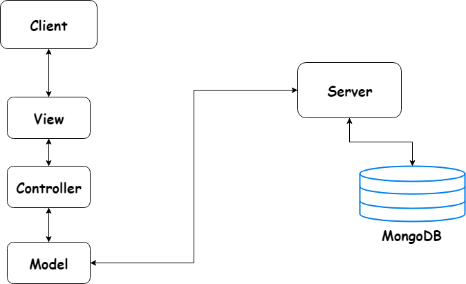
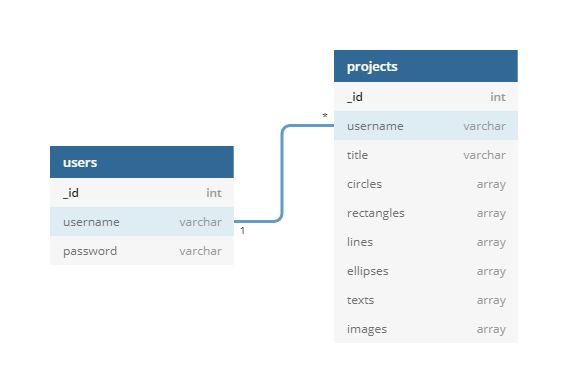

<html style="background-color:lavender;">

<head>
    <meta charset="utf-8">
</head>

<body prefix="schema: http://schema.org">
    <header>
        <h1>
            E-card Web Editor raport
        </h1>
        

            <section typeof="sa:AuthorsList">
                <h3>Autori</h3>
                <ul>
                    <li typeof="sa:ContributorRole" property="schema:author">
                        
                            <meta property="schema:givenName" content="Marius">
                            <meta property="schema:additionalName" content="Marian">
                            <meta property="schema:familyName" content="Blaj">
                            Marius M. Blaj
                        
                        <ul>
                            <li property="schema:roleContactPoint" typeof="schema:ContactPoint">
                                <a href="mailto:marius.blaj@info.uaic.ro" property="schema:email">marius.blaj@info.uaic.ro</a>
                            </li>
                        </ul>
                    </li>
                </ul>
                <ul>
                    <li typeof="sa:ContributorRole" property="schema:author">
                        
                            <meta property="schema:givenName" content="Lavinia">
                            <meta property="schema:familyName" content="Disca">
                            Lavinia Disca
                        
                        <ul>
                            <li property="schema:roleContactPoint" typeof="schema:ContactPoint">
                                <a href="mailto:lavinia.disca@info.uaic.ro" property="schema:email">lavinia.disca@info.uaic.ro</a>
                            </li>
                        </ul>
                    </li>
                </ul>
            </section>
        

    </header>
    <section typeof="sa:Abstract" id="abstract" role="doc-abstract">
        <h3>Abstract</h3>
        

            E-card Web Editor este o aplicatie pentru crearea digitala a unor ilustrate si impartasirea lor cu cei dragi.
        

    </section>
    <section>
        <h3>Obiective</h3>
        

            Ne propunem ca la accesarea paginii web, utilizatorul sa fie intampinat de pagina de logare in aplicatie. Dupa logare, utilizatorul poate sa acceseze e-cardurile create anterior sau la care are acces sau sa creeze unul nou. Optiunile de editare ale unui
            proiect sunt: pencil drawing, insert shape, eraser, insert photo, resizing, insert audio, insert text, add comment.
        

    </section>
    <section>
        <h3>
            Interactiune server-client
        </h3>
        

            Serverul primeste cerere de autentificare de la utilizatori si permite sau nu accesul. Odata logati, utilizatorii pot cere proiectele la care au acces. Dupa ce editeaza un proiect si il salveaza, serverul primeste o cerere de updatare a proiectului.
        

    </section>
    <section id="techs">
        <h3>Tehnologii utilizate</h3>
        <ul>
            <li>JavaScript pentru implementarea functionalitatilor</li>
            <li>HTML si CSS pentru vizualizarea paginilir,respectiv pentru stilizarea paginilor</li>
            <li>MongoDB pentru managementul bazei de date</li>
            <li>Express js pentru implementarea serverului</li>
        </ul>
    </section>
    <section>
        <h3>
            API-uri folosite
        </h3>
        <ul>
            <li>Imgur - poze</li>
            <li>Giphy - GIFs</li>
        </ul>
    </section>
    <section>
        <h3>Arhitectura aplicatiei: MVC</h3>
        <figure typeof="sa:image">
            
        </figure>
        

            <ul>
                <li><b>View</b>: reprezinta interfata grafica cu care interactioneaza utilizatorul</li>
                <li><b>Controller</b>: interpreteaza inputurile provenite din View</li>
                <li><b>Model</b>: trimite cereri serverului si proceseaza raspunsurile primite</li>
                <li><b>Server</b>: se ocupa de managementul bazei de date si de autentificarea utilizatorilor</li>
            </ul>
        

    </section>
    <section>
        <h3>Database Diagram</h3>
        <figure typeof="sa:image">
            
        </figure>
    </section>
</body>

</html>
